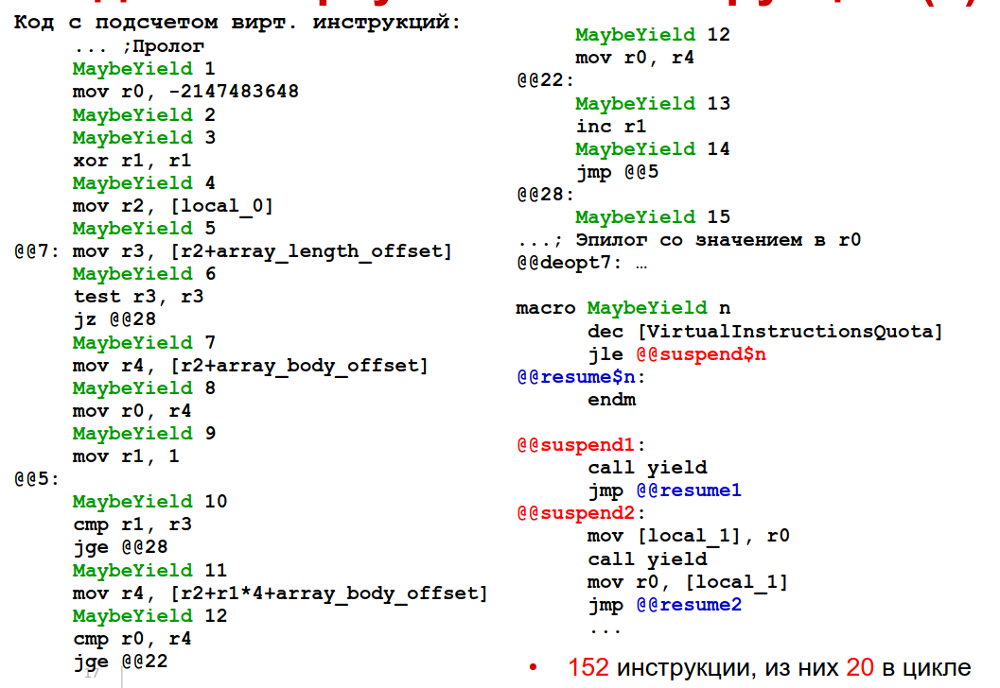
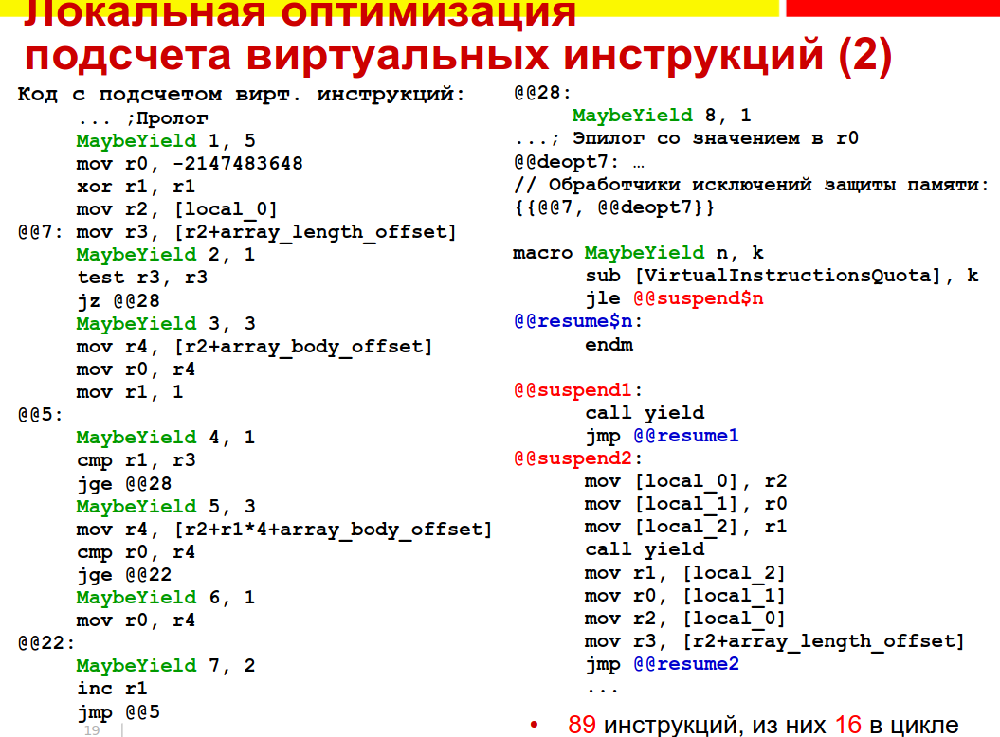
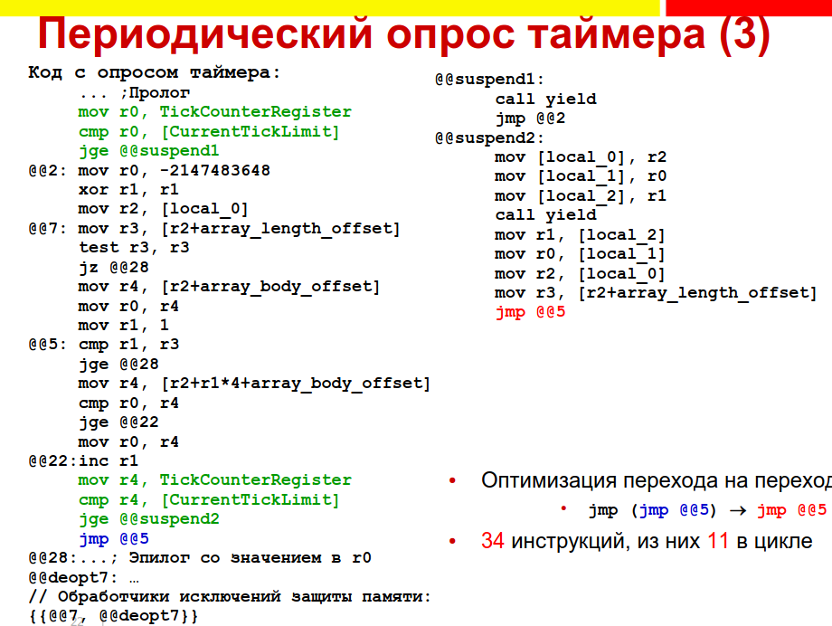
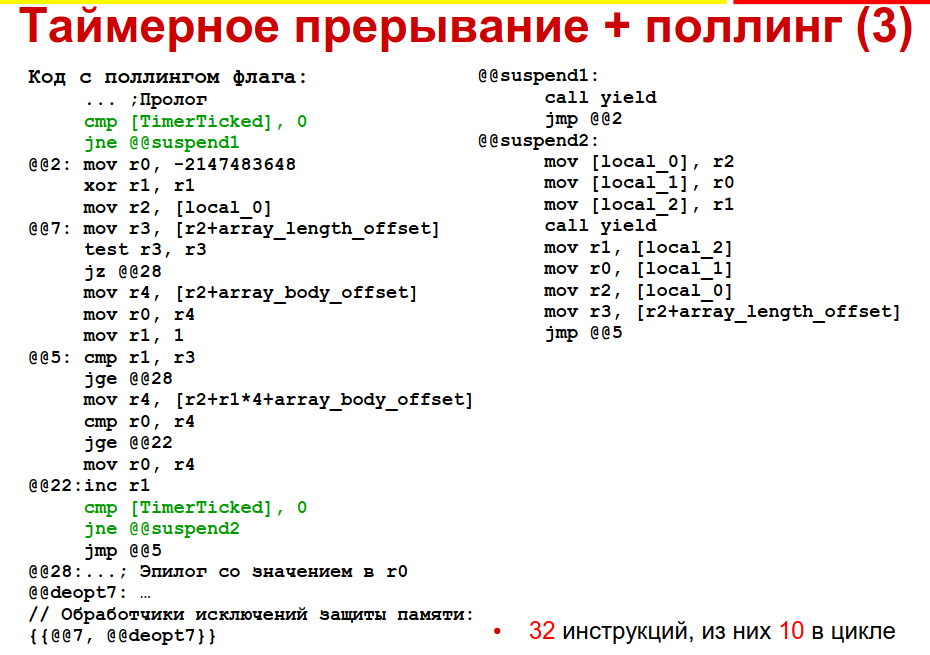
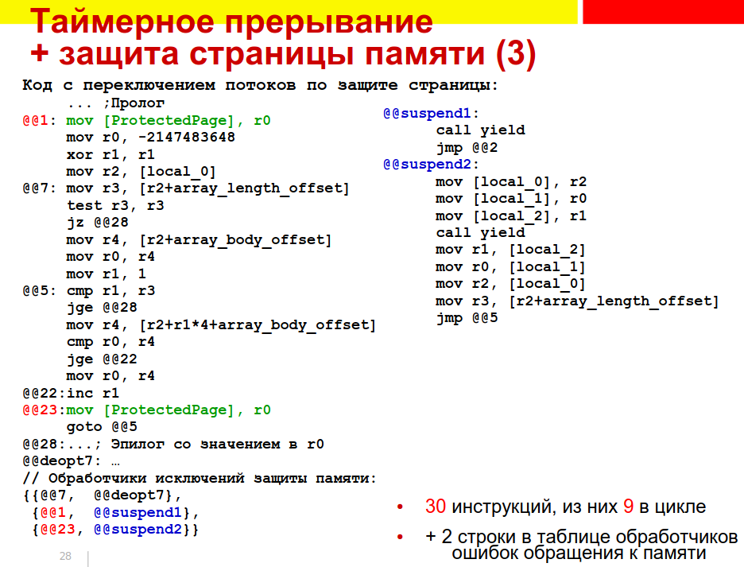
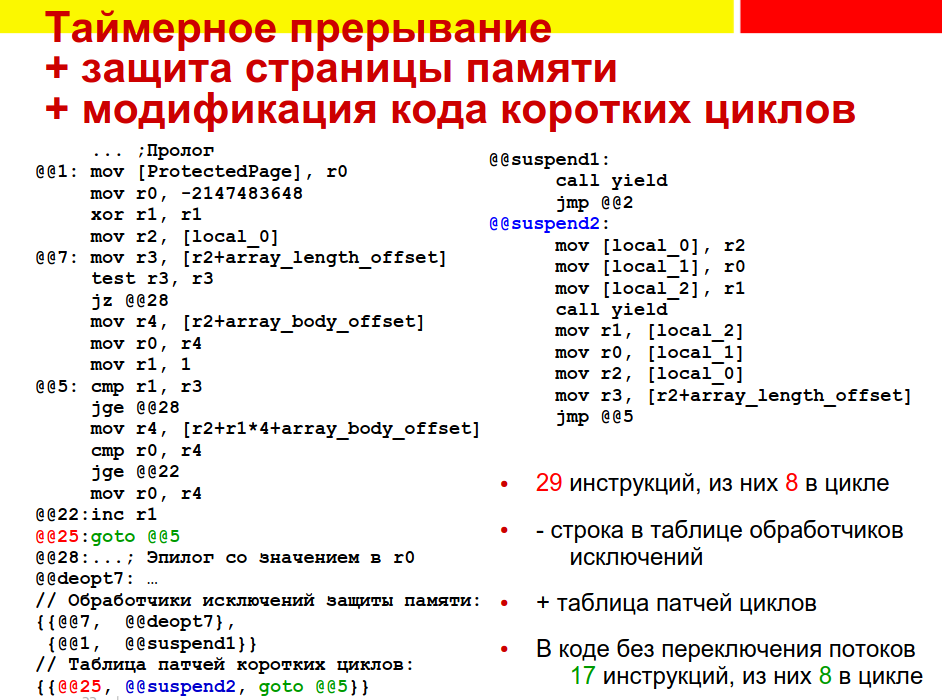

= Варианты реализации многопоточности
* Нативная вытесняющая многопоточность
Вытесняется автоматически 
* Кооперативная многопоточность
позволяет переключать потоки
** Кооперативная нативная многопоточность (есть виртуальный контекст)
** Виртуальная многопоточность
* Обобщённая M:N многопоточность 

 Выполнение M языковых потоков при помощи N нативных потоков, где N задается в соответствии с возможностями аппаратуры

** M:M — нативная вытесняющая многопоточность
** M:1 — кооперативная многопоточность
** M:0 — кооперативная многопоточность в режиме разделения времени (time sharing, slave mode). 

 Используется в операционных системах, управляемых событиями (event driven), где вместо потоков обработчики событий. Чтобы один поток выполнялся -- он должен кидать события сам себе.

== Нативная  вытесняющая многопоточность
● Каждому виртуальному потоку соответствует
собственный нативный поток
● Многопоточность обеспечивается средствами ОС

== Нативная многопоточность
● Каждый виртуальный поток выполняется поверх
соответствующего ему нативного потока
* Операционная система осуществляет
** Переключение потоков
** Планирование (thread scheduling)
** Синхронизацию

Т.к. это делает ОС -- Переключение потоков может происходить где
угодно, в том числе в ВМ. Чтобы этого избежать необходимо использовать критические
секции внутри VM

* Работает настолько хорошо, насколько
обеспечиваемые ОС функции соответствуют:
* Спецификации реализуемого языка
** Количество уровней приоритетов
** Стратегия вытеснения 
** Средства синхронизации
* Потребностям приложения -- ОС может ограничивать количество потоков и системных семафоров. Например, встраиваемые ОС обычно поддерживают немного потоков.

== Кооперативная многопоточность внутри VM
● библиотека «Green Threads» - кооперативная многопоточность
на уровне библиотеки без поддержки ОС
● Каждой виртуальной нити соответствует
собственный *нативный контекст* выполнения
● Единственный нативный поток, переключение
между контекстами при помощи setjmp/longjmp (команды языка С. сохраняем туда контекст и в произвольный контекст можем на него перейти)

● Интерпретатор периодически вызывает
планировщик
● Планировщик в соответствии с реализуемой
политикой выбирает поток, который будет
исполняться следующим
● Если следующий поток не совпадает с
текущим, планировщик нативными
вызовами
● Сохраняет (setjmp) контекст текущего потока
● Восстанавливает (longjmp) контекст следующего
потока
● Многопоточность
● Кооперативная на уровне нативного кода
● Вытесняющая на уровне виртуального кода

в виртуальном коде этих команд нет и смена потоков кажется нативной.

Вызванная из интерпретатора нативная функция
* Может содержать длительные циклы, но цикл должен сам периодически вызывать планировщик
* В частности, можно из нативной функции вызывать
интерпретатор


Нативный контекст представлен нативным стеком и состоянием регистров

Каждый нативный стек

* Может переполниться -- Переполнение нужно обнаруживать и предотвращать
* В общем случае позиционно-зависим -- его содержимое зависит от положения в памяти (ссылки) -- Например, динамическая цепочка вызовов
* Состоит из нативных секций сложной структуры -- Обход всех секций и их релокация затруднены
* Поэтому такие стеки отводится вне дефрагментируемой кучи

Недостатки

* Не в каждом языке реализации есть аналог jongjmp
* Часто компиляторные оптимизации выключаются в окрестности longjmp

== Виртуальная многопоточность
* Единственные нативный поток и нативный контекст
* Множественные виртуальные поток, которые все живут в общем нативном контексте

● У виртуального потока нет собственного
нативного контекста
● Интерпретатор периодически:
● Сохраняет виртуальные регистры в текущий
виртуальный контекст
● Вызывает планировщик
● Планировщик:
● Выбирает виртуальный поток, который будет
исполняться следующим
● Устанавливает его в качестве текущего
● Возвращается в интерпретатор
● Интерпретатор:
● Восстанавливает виртуальные регистры из
текущего виртуального контекста
● Продолжает выполнение


Никаких функций не используется, все реализуется вручную

Вызываемые из интерпретатора нативные
функции 
* обязаны быстро завершаться
* Не должны содержать длительных циклов, Может потребоваться преобразование кода
* Функции ввода-вывода должны быть
неблокирующими -- можно реализовать вручную с помощью пула потоков и блокирующих вызовов


● Обычно сложнее и медленнее блокирующих
● Эффективно реализуема на любом языке
● В отличие от longjmp, не конфликтует с
компиляторными оптимизациями
● Виртуальные стеки
● Состоят из секций определяемой нами структуры
● Переместимы
● Могут содержать производные указатели
● Могут быть размещены в дефрагментируемой куче
● Могут менять размер
● На месте или при помощи копирования

== Когда отдавать управление
планировщику
● В момент передачи управления поток
управления должен находиться в
семантически непротиворечивом состоянии
● Не всякое нативное состояние выразимо как
состояние виртуального вычислителя
● Точки переключения потоков должны быть
быстро достижимы
● Достаточно разместить их в вызовах и циклах
● Циклы бывают с множественными выходами, поэтому
предпочтительнее точку переключения поместить в
начало тела цикла, а не в его конец
● Число вызовов обычно превосходит число методов,
поэтому предпочтительнее точку переключения
поместить в пролог метода, а не в код вызова
● Полезно периодически в длинных блоках
● Точки переключения потоков можно совместить с
точками безопасной сборки мусора. Не каждая точка сборки мусора должна бы

== Как отдавать управление планировщику
Как отдавать управление
планировщику
* Подсчет виртуальных инструкций
● Периодический опрос высокоточного таймера. спрашиваем текущее время. Если с предыдуше
● Таймерное прерывание + поллинг. Программируем таймер, чтобы он писал флажки и проверял их сам. 
● Таймерное прерывание + защита страницы. По таймерному прерыванию 
● Модификация кода циклов

=== Подсчет виртуальных инструкций 
● Планировщик назначает интерпретатору квоту
виртуальных инструкций
● Выполнение виртуальной инструкции
потребляет квоту
● Инструкциям могут быть назначены веса
● По исчерпании квоты вызывается планировщик
● Очень просто реализовать, не требует каких-либо функций ОС
● Не учитывает длительности выполнения
вызванных нативных функций, но функция может самостоятельно уменьшить квоту
● Скомпилированному коду приходится считать
число исполненных виртуальных инструкций. Подсчет можно оптимизировать, но количество инстуркций все равно значительно увеличивается.

Пусть каждая функция потребляет по 1 единичке из квоты 

```
…
if (--VirtualInstructionsQuota < 0) goto slow_path_1;
fast_path_1:
Реализация виртуальной инструкции 1;
if (--VirtualInstructionsQuota < 0) goto slow_path_2;
fast_path_2:
Реализация виртуальной инструкции 2;
…
return;

slow_path_1:
Save caller-saved registers;
call Yield;
Restore caller-saved registers;
goto fast_path_1;

slow_path_2:
Save caller-saved registers;
call Yield;
Restore caller-saved registers;
goto fast_path_2;
```

Сохраняем живые регистры. Вызываем функцию отдачи управления планировщику (yield). Восстанавливаем регистры, переходим на новый участок кода.

Справа -- код без переключения потока. 

image::media/ex_1.png[]

Вставим в него подсчет количествва виртуальных инструкций и переключения потоков. 



MaybeYield -- макрос, декрменетирует квоту и если нужно переходит на точку переключения потоков.

=== Оптимизации
==== Локальная оптимизация подсчета виртуальных инструкций 
…
if ((VirtualInstructionsQuota -= block_length_1) < 0)
goto slow_path_1;
fast_path_1:
Реализация всех виртуальных инструкций блока 1;
…
return;
slow_path_1:
Save caller-saved registers;
call Yield;
Restore caller-saved registers;
goto fast_path_1;

В начале блока проверим, достаточно ли
квоты для выполнения всех его инструкций:

* Если нет, перейдем на медленную реализацию с проверкой при каждой инструкции
* Если квоты велики по сравнению с длинами объединяемых последовательностей инструкций,
то просто отдадим управление планировщику. 



Все равно слишком дорогая оптимизация.

==== Периодический опрос таймера
Периодический опрос таймера (1)
● Аппаратура и ОС должны обеспечивать
эффективное чтение относительного
времени или счетчика тактов процессора
● Планировщик назначает предел времени
исполнения
● Интерпретатор и скомпилированный код в
точках переключения читают текущее время
и сравнивают с назначенным пределом
● В лучшем случае чтение специального регистра,
предела из памяти и условный переход

```
…
tmp_reg = TickCounterRegister;
if (tmp_reg >= CurrentTickLimit) goto slow_path_1;
fast_path_1:
…
return;
slow_path_1:
Save caller-saved registers;
call Yield;
Restore caller-saved registers;
goto fast_path_1;
```



Синим выделена точка, на которую мы переходим (раньше там был переход на переход, здесь применили оптимизацию **выпрямление переходов**)

Время выполнения цикла увеличилось всего на треть!

== Таймерное прерывание + поллинг глобального флага(1)
Программируем таймерное прерывание на
нужную частоту
● Или заводим отдельную нативную нить и ждем
таймерного события в цикле
● Аппаратура и ОС должны предоставлять такую
возможность
● Принудительно в произвольный момент
забрать управление у интерпретатора и
скомпилированного кода нельзя!
● Неопределенное состояние виртуального
исполнения
● Выставляем глобальный флаг, проверяемый
интерпретатором и скомпилированным
кодом в каждой точке переключения
● В лучшем случае чтение памяти, сравнение и
условный переход
● Вызванный планировщик сбрасывает флаг

```
…
if (GlobalFlag != 0) goto slow_path_1;
fast_path_1:
…
return;
slow_path_1:
Save caller-saved registers;
call Yield;
Restore caller-saved registers;
goto fast_path_1;
```



== Таймерное прерывание + защита страницы памяти (1)
● Поллинг глобального флага недостаточно
эффективен для скомпилированного кода
● Особенно в циклах
● Таймерное прерывание случается редко — в
подавляющем числе проверок флаг не выставлен
● По таймерному прерыванию защищаем
специально выделенную страницу памяти
● Аппаратура и ОС должны достаточно эффективно
поддерживать установку и снятие защиты и
обработку прерывания защиты страниц
● Вместо опроса глобального флага пишем
произвольный регистр в эту страницу (нам важно не что пишем, а сам факт записи)
● Для чтения потребовался бы свободный регистр
● При обработке прерывания ищем обработчик
переключения в локальной таблице. Он сохраняет
локальный контекст и передает управление
планировщику. Планировщик снимает защиту со страницы 

…
check_1:
*ProtectedPage = any_reg;
fast_path_1:
…
return;
slow_path_1:
Save caller-saved registers;
call Yield;
Restore caller-saved registers;
goto fast_path_1;
Локальная таблица точек переключения:
(check_1, slow_path_1)
(check_2, slow_path_2)
…

на точку прееключения нет адреса, мы ищем его в локальной таблице. прерывание защиты страниц происходит по известному адресу. Когда возвращаемся из обработчика прерывания в свою программу -- продолжение продолжается не предыдущего кода, а кода нового потока.



* код сократился, метаданные метода выросли

== Таймерное прерывание + модификация кода коротких циклов (1)
● В маленьких скомпилированных циклах
заметны накладные расходы выполнения
каких-либо дополнительных инструкций
● Если компилятору известно, что число повторений
ограничено сверху небольшой константой, он может
обойтись без точки переключения в цикле
● Наблюдение: Код можно модифицировать
● Динамически скомпилированный - всегда
● Статически скомпилированный - часто
● Иногда ОС накладывает ограничения
● После изменения страницы кода каждый
экземпляр процесса или динамически загружаемой
библиотеки получит свою копию этой страницы (количество памяти, используемой процессом, возрастает)

=== Как реализовать? 

Будем по таймерному прерыванию переписывать код (любой) в точках переключения. 

 Во время компиляции метода зарегистрируем
его точки переключения в таблице патчей
● Элемент таблицы содержит:
● Адрес модифицируемого кода
● Исходный код по этому адресу (чтобы его восстанавливать)
● Адрес (смещение) локального обработчика

Во время таймерного прерывания
● По адресу текущей инструкции находим текущий
скомпилированный метод
● Применяем все патчи из таблицы патчей этого
метода ()
● Патчей обычно немного
● Таймерное прерывание асинхронное, поэтому
анализ, находится ли управление в каком-либо из
коротких циклов и в каком именно, в этот момент
затруднен

● При достижении точки переключения:
● Вычислитель находится в семантически
непротиворечивом состоянии
● Обработчик получает управление
● Сохраняет контекст
● Отдает управление планировщику
● Планировщик проходит по таблице патчей
текущего метода, восстанавливает исходный код
во всех точках переключения

Не гарантирует переключения.

Но всегда ли в момент таймерного прерывания
можно найти текущий метод?
● Трудно, если мы находимся в функции рантайма,
вызванной из кода метода
● … или в прологе метода до создания секции стека
● Бесполезно, если в его эпилоге
● Невозможно, если в планировщике. Там нет понятия "текущий метод".


● Модификация и восстановление кода
производятся в пределах текущего метода
● Вызов, возврат, бросание исключения могут
вывести за пределы метода
● Код может остаться изменённым после выхода за
пределы метода
● Сложный и не всегда срабатывающий способ
● Не всегда удаётся определить текущий метод
● Управление может покинуть метод, не исполнив
вписанный код
● Дополняет, а не заменяет прочие способы
● Используем его только для снижения расходов
в коротких скомпилированных циклах



Длина циклов с этой оптимизацией осталась неизменна!


== Гибридная многопоточность
Когда ОС поддерживает многопоточность, но ее мощностей не достаточно для спецификации языка.

● ОС поддерживает нативную вытесняющую
многопоточность
● Эта многопоточность может не соответствовать
спецификации языка
● Может быть ограниченной — например,
небольшим числом нативных потоков
● Можно на одном нативном потоке запустить
несколько ненативных
● Смешанная вытесняющая и кооперативная
многопоточность
● Или использовать пул нативных потоков для
реализации неблокирующего ввода-вывода
при помощи блокирующих операций

== Синхронизация
Синхронизация в языке Java
● Низкоуровневая, трудна в использовании
● Синхронизированными могут быть методы и
блоки
● synchronized public void myMethod() {…}
● synchronized(obj) { … }
● Методы синхронизированы на объекте-
получателе (this)
● Статические методы синхронизированы на
статике определяющего их класса
● В каждый момент внутри синхронизированного
на одном объекте метода или блока может
находиться не более одного потока
● Другие потоки при попытке входа будут
заблокированы и поставлены в очередь ожидания

Реализация синхронизации (1)
● Виртуальная машина ассоциирует объект с
монитором и очередью ожидания
● При входе в синхронизированный метод или
блок (байткод monitorenter) пытаемся
захватить монитор объекта синхронизации
● Если монитор был свободен, продолжаем
исполнение
● Если нет, становимся в очередь, отдаем
управление планировщику
● При выходе из синхронизированного метода
или блока (байткод monitorexit) пытаемся
освободить поток из очереди ожидания
объекта синхронизации
● Мониторы — короткоживущие объекты
● Мониторы широко используются в библиотеках
● Эффективность реализации мониторов
критична для производительности VM

* Наблюдение 1: синхронизация происходит на
очень небольшом числе объектов
** Это свойство устойчивое — если однажды объект
использовался для синхронизации, вероятно, что
он будет для этого использоваться вновь
** Следствие: не надо раньше времени ассоциировать объект с
монитором и разрушать эту ассоциацию
* Наблюдение 2: чаще всего при входе в
синхронизированный блок монитор свободен. 
** Uncontended — имеется только один желающий
его захватить поток

=== Пример реализации

* У объекта в заголовке имеется указатель
monitorOrHashCode
* Вследствие выравнивания два младших бита
его свободны, это используют как флаг состояния потока.
** 00 — старшие 30 битов содержат хэш-код
** 01 — uncontended monitor, в старших битах адрес
захватившего монитор потока
** 10 — extended uncontended monitor — кратное
вхождение потока в один и тот же монитор, в
старших битах адрес потока
** 11 — contended locking. В очереди ожидания
имеются другие потоки. Старшие биты содержат
адрес монитора. Сам монитор отведен на стеке
захватившего его потока

Зачем разделять 01 и 10? Чтобы разделять когда мы выходим из рекурсивного и все еще захватываем ресурс или выходим и освобождаем. Дополнительно где-то еще хранится счетчик.

== Модель памяти

Современные ЭВМ не являются строго
последовательными
* Несколько процессоров
* Несколько потоков выполнения в каждом
* Потоки могут переупорядочивать инструкции
*  Обращения к памяти буферизуются и кэшируются

Модель памяти определяет правила, которым
должны следовать многопоточные
программы для получения
детерминированных результатов. Чтобы ее реализовать вводятся специальные инструкции

* Атомарные
* CAS
* Обеспечение когерентности кэшей
* Барьеры обращения к памяти (fences)

 Для платформенной независимости VM
должна определять свою модель памяти

=== Пример: Java Memory Model
Определяет *наблюдаемый частичный порядок* над
действиями. В частности, порядок транзитивен. Частичный -- значит, что  сущетсвует только над подмнрожеством действий 

* В пределах одного потока порядок выполнения
инструкций определяется их последовательностью
* Для каждого монитора операция unlock происходит
перед каждой последующей операцией lock
* Для каждого волатильного поля запись происходит перед каждым последующим чтением
* Выполняемые потоком действия начинаются после
его старта и заканчиваются до того, как любой
другой поток увидит его (потока) завершение 
* Прерывание одного потока другим происходит до
того, как первый обнаружит это прерывание
* Финализатор объекта выполняется после
завершения его конструктора

● У этих правил сложные последствия
● Brian Goetz, Tim Peierls, Joshua Bloch, Joseph Boebeer,
David Holmes, Doug Lea. Java Concurrency in Practice.
Eddison-Wesley, 2006
● В этой книге около 500 стр.
● Семантика нарушающей правила программы не
определена
● Правила ограничивают компиляторные
оптимизации
● Например, волатильные поля нельзя кэшировать в
локалах


Для удобства применения правил вводятся специальные языковые конструкции, разрабатываются специальные библиотеки

* Синхронизированные коллекции
* Конкурентные коллекции
* Блокирующие очереди
* Синхронизаторы
* ...