= Отведение памяти в программном стеке 

== Отступление: Активация процедуры
● Активация процедуры — ее
параметризованный экземпляр
● Впервые появилась в языках с блочной
структурой (Алгол-58)
● Создается в момент вызова процедуры
● Уничтожается при выходе из процедуры
● Содержит адрес возврата, значения всех
параметров и локальных переменных
● Активация вызванной процедуры живет не
дольше активации вызвавшей ее процедуры
● Такая дисциплина вызовов-возвратов
реализуется при помощи центрального
(программного) стека
● Активация представляется записью
активации (секцией стека)

=== Виды секций стека
● Секция стека может быть фиксированной или
переменной длины
● Размер секции фиксированной длины определяется
вызываемой процедурой, одинаков для всех ее
активаций и иногда называется аппетитом данной
процедуры
● Размеры и смещения локальных данных
относительно начала секции и аппетит
вычисляются во время компиляции
● Размер секции переменной длины может меняться в
течение жизни одной активации
● Начальный размер определяется аппетитом
● Например, секция может содержать стек для
передачи параметров виртуальным инструкциям
● Например, можно отводить память в текущей
секции
● Разным процедурам могут соответствовать
разные виды и разные форматы секций
активации

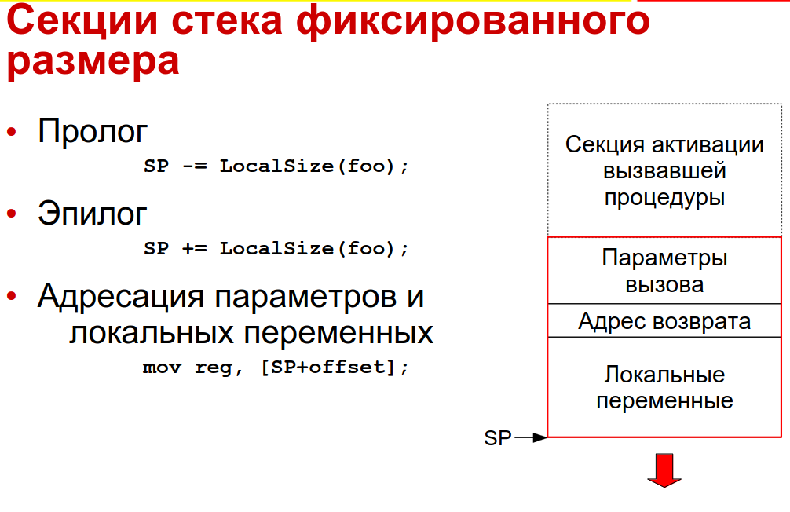

size(..) -- это не функция, а контанта времени компиляции

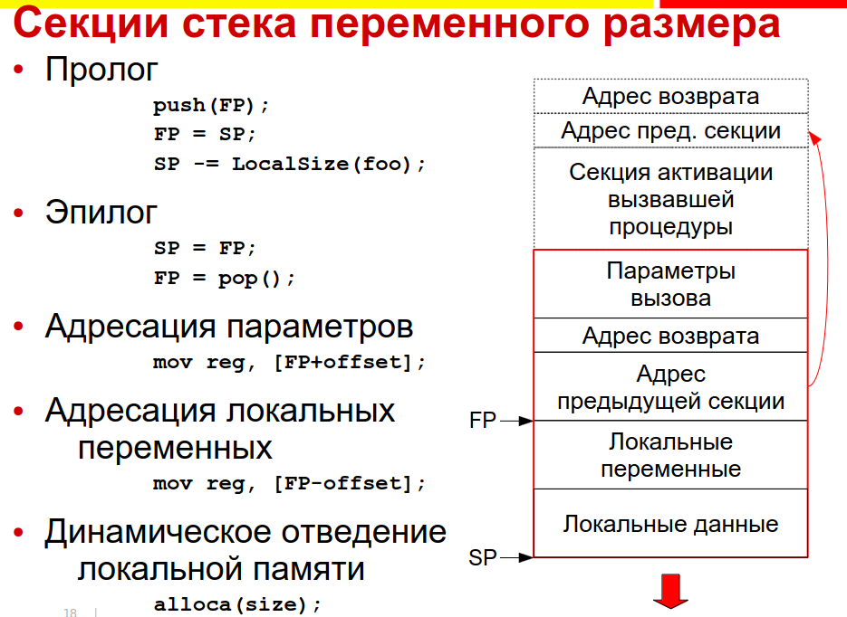

alloca -- псевдофункция

== Отведение памяти в пулах


Управление памятью в пулах

● Пул — область памяти, в пределах которой
организуется распределение в соответствии с
некоторой специфической дисциплиной 

Область памяти пула
● Может отводиться статически, функцией ОС, в
другом пуле или куче
● Может быть непрерывной или кусочной
● Может быть фиксированного или изменяемого
объема

Примеры дисциплин
● Стек — отведение с дисциплиной LIFO
● Отведение и освобождение объектов
фиксированного размера (отводим их не в обычной куче ,а  в специальном пуле)
● Отведение объектов со сходными временами жизни
(scoped memory)
● Некоторые контейнеры содержат пулы для хранения
своих элементов, чтобы хранить их эффективно

=== Преимущества специализированного распределения памяти
Скорость
● Для отведения достаточно нескольких машинных
инструкций
● Единовременное освобождение всего пула

Предсказуемость
● Худший случай не сильно хуже среднего
● Из-за простоты реализации легко поддается анализу

Минимизация внутренней фрагментации (заголовков
объектов, служебных структур, потерь на округление
размера). Внутреннюю  фрагментацию никак извести нельзя, это расходы на выделение объектов.

Минимизация внешней фрагментации. Можно исправить в рамках системы управления памятью.

Отведение памяти в пулах — это оптимизация
● Не следует тратить на нее усилия без необходимости, если нет уверенности, что это узкое место программы.
● Современные реализации отведения памяти в куче
достаточно хороши для многих применений

=== Базовые механизмы
отведения памяти в пулах

==== Линейное/последовательное продвижение указателя (Pointer Bumping)
Может быть восходящим или нисходящим.

Byte* first_free;

Восходящее (в направлении роста адресов)
Byte* p = first_free;
first_free = p + size;
return p;

Нисходящее (в направлении убывания адресов)
return (first_free -= size);
● Чуть меньшее регистровое давление (меньше временных данных нужно)
● Чуть удобнее растить области памяти вниз (это чаще поддерживается ОС и железом)

Преимущества 

● Высокая локальность последовательно отводимых
данных
● Откат к запомненной позиции с освобождением всех
позднее отведенных данных

```
//запоминаем локальный указатель переменной
Byte* const remembered_position = first_free;
… /пытаемся что-то сделать
//восстанвлвиаем состояние
first_free = remembered_position;
```


==== Отвязывание из линейного списка
```
struct LinkedItem {
LinkedItem* next;
};
LinkedItem* first_free;
LinkedItem* p = first_free;
first_free = p->next;
return p;
```

=== Проверка переполнения при
последовательном отведении
● Часто в одном базовом блоке встречаются
несколько отведений памяти. Нельзя ли
уменьшить стоимость проверок?


Когда отводим объекты из пула, то отдельная функция вызывает функцию allocate, возможно несколько раз. Нужно проверять на переполнение, количество проверок хочется сократтить

==== Локальное изведение избыточных проверок путем специализации кода

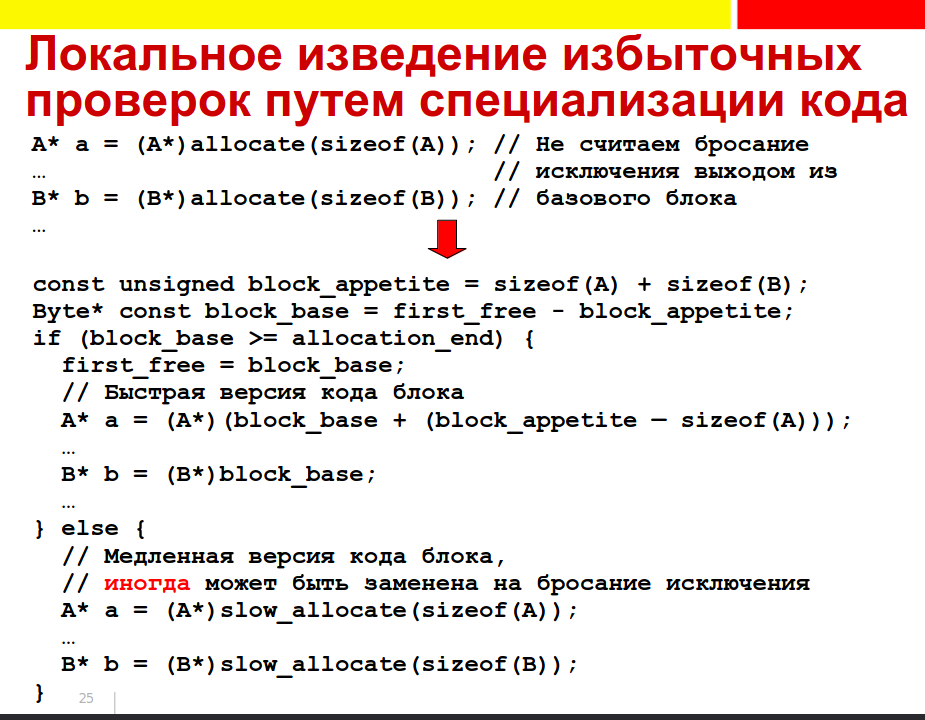

* считаем   суммарный аппетит блока, пытаемся выделить паммять под суммарный размер. Если получилось -- записываем указатель в память, дальнейшие отведелния объектов -- арифметика с этой базой.

Если мест  недостаточно -- генерируем обычную медленнную версию, где allocate идет  последовательно со  всеми  проверками  и кидает исключение в том месте, где не хватило памяти.

Можно вместо этого сразу бросать исключения, когда суммарный аппетит  слишком велик. Но тогда теряется точность ошибки.

Локальное изведение избыточных проверок в
общем случае примерно удваивает размер
базового блока
● Быстрая версия кода короче оригинальной
● Последующие оптимизации способны полученный
размер сократить

Локальное изведение можно обобщить для
расширенных базовых блоков
● Единственный вход, множественные выходы


… и ациклических подграфов графа управления
● Редуцируем не отводящие память блоки
● Обходом ациклического подграфа в глубину для
каждого блока вычисляем его собственный аппетит
и минимальный и максимальный аппетиты с учетом
последующих блоков

нужно там, где выжимаются последние крошки производительности


== Ручное отведение в куче

«Куча» - обобщение пула для произвольной
дисциплины отведений-освобождений и
произвольных типов объектов. Аналогично пулам, это вторичная  (мы откуда-то получили память и начинаем ее дальше распределять) система отведения, может быть фиксированного или переменного размера, непрерывной или кусочной

Расходы на синхронизацию обращений к глобальной куче при многопоточной реализации могут быть существенными

Для мелких объектов внутренняя фрагментация может в глобальной куче быть значительной
● Округление размера
● Обрамление объекта (header & footer)

Внешняя фрагментация -- Коэффициент внешней фрагментации памяти
пропорционален логарифму отношений максимального и минимального размеров объектов
J.M.Robson. An estimate of the store size necessary for
dynamic storage allocation. Journal of the ACM, July 1971.

=== Программный интерфейс «кучи» 
* void* allocate(size_t size)

  Отвести блок памяти для размещения одного или более объектов указанного суммарного размера. При size=0 может, но не обязан выдать NULL (мб уникальный адрекс, стандарта нет) При исчерпании памяти выдает NULL или кидает исключение в зависимости от языка

* void free(void* p)
  Освободить ранее отведенный блок, здесь p - ранее полученный результат allocate,в т.ч. NULL если это допустимо в языке

* Вариант: void free(void* p, size_t size)
** Компилятор берет под свою ответственность
быстрое вычисление размера блока
** Обычно применяется для блоков, состоящих из
отдельных языковых объектов (когда не выкедляем объекты пачками)
** Размер объекта вычисляется по его типу Например, у строки -- длина (в
частности, размер может быть записан в объект,
его класс или VMT. ). Это имеет смысл не для всех
реализаций языков

* void* resize(void* p, size_t new_size)

 Изменить размер на месте или путем копирования. Здесь p - ранее полученный результат allocate,в т.ч. NULL.

** Вариант: void* resize(void* p, size_t
old_size, size_t new_size)
** Изменение на месте — полезная, но не
обязательная оптимизация последовательности.  По возможности, расширяет на месте. Иначе выделяет  новый блок и  копирует данные, освобождая старый.
● Отвести блок нового размера
● Скопировать в его начало содержимое старого
● Освободить старый блок


* Могут быть дополнительные функции для отладки
и тестирования (heapwalk, heapdump)

=== Элементы реализации «кучи» 
==== 1. Гарантированное выравнивание
Инструкции процессора могут требовать или работать эффективнее с выровненными данными. Система отведения «кучей» должна гарантировать максимальное требуемое выравнивание адреса (если есть  два типа, для которых гарантируется -- берем  максимальный, гарантируем егшо)
● Смещения полей объектов с учетом их
выравниваний назначит компилятор
● Для уменьшения размера объектов поля лучше
отсортировать в порядке уменьшения выравнивания
==== 2. Округление размера вверх
● Обычно до максимального требуемого выравнивания
● Большие объекты могут округляться и выравниваться
на большую границу
● Потери на округление являются элементом
внутренней фрагментации
allocation_size(size) = max(round_up(size) + live_block_framing, min_block_size)


==== 3.Обрамление блоков
● Система управления «кучей» может хранить
связанные с блоком служебные данные до
(заголовок, header) и после него (footer)
● В свободном блоке можно хранить больше служебных
данных, чем в занятом, но минимальный размер
свободных и занятых блоков одинаков
● Передача размера компилятором в запросы может
исключить или снизить потребность в обрамлении

==== 4. Деление (расщепление) блоков (block splitting)
Если при отведении блока не удается найти точно
подходящий ему по размеру свободный блок, можно:
* Запросить у первичной системы отведения больше
памяти
* Или отвести блок большего размера (часть памяти
при этом станет недоступной для отведения)
* Или разделить блок большего размера на
требуемый блок и оставить остаток свободным

Не обязательно стремиться к минимизации остатков

==== 5. Слияние соседних свободных блоков (block
coalescing)
● У освобождаемого блока могут оказаться свободные
соседи непосредственно до и после него
● Эти блоки можно слить для образования блока
большего размера и снижения числа блоков
● Не всегда слияние сразу при освобождении является
лучшей стратегией, ближайший запрос на отведение может потребовать
деления только что слитого блока

==== 6. Классы размеров
● Отводимые блоки делятся на классы по размеру
● Например, малые, средние и большие
● Разные классы размеров могут управляться
различными механизмами. Не все механизмы одинаково пригодны для всех
классов размеров

== Традиционные классы механизмов управления «кучей»
1. Последовательный поиск подходящего блока
* First Fit,
* Next Fit ищем не с начала, а с того места, где остановились при поиске в прошлый раз. Преимущества вроде нет.
* Best Fit -- ищем среди всех точный совпадающий или с наименьшей разницей
* Worst Fit с вариациями -- максимизируем размери остатка объекта

2. Разделение объектов по размерам
 Раздельное хранение (Segregated Storage) и раздельный поиск (Segregated Fit)
* Раздельное хранение позволяет определить размер
объекта по его адресу без использования заголовка

3. Метод близнецов: Двоичных, взвешенных (несколько двоичных серий с малыми весами), Фибоначчиевых и двойных (3=2+1)

4. Индексированный поиск -- Indexed Fit (используются специальные структуры поиска блока по размеру)

5. Поиск в битовом массиве -- Bitmapped Fit -- битовая шкала, в которой ищем блок нужной длинны.

=== Последовательный поиск
подходящего блока (1)
● Возьмём в качестве основы пул
последовательного отведения поверх какой-
либо системы первичного отведения памяти
● Непрерывный или кусочный
● Фиксированного или переменного размера
● С восходящим или нисходящим отведением
● Для определенности будем использовать
восходящее отведение

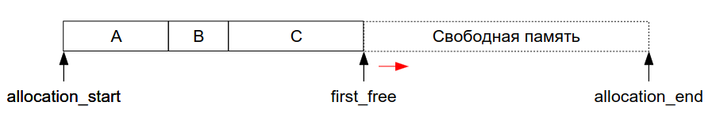

● Пул обеспечивает отведение памяти и
освобождение последнего отведенного блока
● Точнее, любой последовательности последних
отведенных блоков
● Пул обеспечивает сокращение размера блока
на месте и увеличение путём его копирования
● Пул с восходящим отведением обеспечивает
увеличение размера последнего блока на месте

перемещаем first_free, если можно  и перемещаем объкет

image::media/seq.png[]


● Дополним пул системой повторного
использования освобождённых блоков
● Освобождение произвольного блока помещает его в
эту систему
● Последний отведённый пулом блок лучше
освободить средствами пула
● При отведении блока сначала пытаемся повторно
использовать ранее освобождённый блок
● Для этого надо знать размеры свободных блоков и
их расположение
● Снабдим освобождённый блок заголовком,
запишем в него размер и адрес следующего
свободного блока
● Это можно сделать, если минимальный размер
блока 2 слова

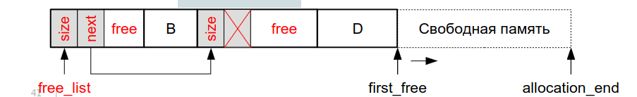

Что делать, если нам хочется выделять объекты меньше, чем 2 слова?

● Вариант: отнесём мелкие блоки размером в
одно слово к другому классу размеров и
используем для них другой механизм

● Вариант: если блок снабжён заголовком, в
котором хранится его размер, можно
использовать другую реализацию
● Размер по рывавниванию, он  четный.Младший бит размера не используется из-за
выравнивания, поместим в него признак занятости блока
● Минимальный размер объекта 0 слов
● Минимальный размер блока 1 слово (заголовок)
● Замедление поиска подходящего свободного блока, т.к. идем не только по свободным блокам, а вообще по всем

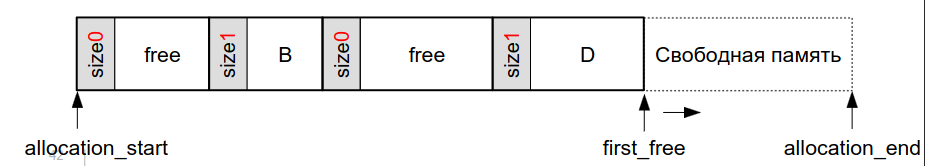

Стратегии поиска подходящего свободного блока
* First Fit - начинаем с начала, ищем первый блок
нужного или большего размера
* Next Fit - аналогично, но начинаем с позиции, в
которой успешно закончился предыдущий поиск, иначе с начала
* Best Fit - ищем лучше всего подходящий по размеру
блок
* Worst Fit — ищем точно совпадающий или хуже всего
подходящий блок, делим его в надежде на будущее
использование остатка (только при поддержке деления блоков)

В таких стратегриях *Деление блоков* Легко осуществимо, если размер остатка не меньше
размера минимального блока. Иначе остаток не может быть оформлен как
отдельный свободный блок и может быть только
использован при расширении блока на месте

● Слияние блоков
● Для слияния с предыдущим блоком нужно знать,
свободен ли он
● Для этого нужно найти его заголовок
● Метод граничных признаков
● Предположим, что блок снабжен заголовком, в
котором хранится его размер
● … и что блоки выровнены минимум на 4 байта и
потому 2 младших бита размера свободны
● Разместим в бите 1 признак занятости предыдущего
блока.В хедаре размер и два признака, в футере -- только размер.
● В конце свободного блока сохраним его размер
● Размер обрамления блоков остается прежним, но
минимальный размер блока увеличивается на слово

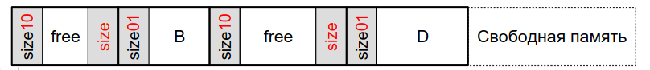

Последовательный поиск
подходящего блока (6)
● Этот механизм пригоден для широкого класса
размеров и всевозможных организаций «куч»
● Основной недостаток - линейная сложность по
числу блоков (т.е. размеру кучи)
● Нужны дополнительные структуры для
ускорения поиска
● Их узлы можно размещать внутри свободных блоков
● От этого минимальный размер блоков увеличится
● Для мелких объектов лучше использовать
отдельный механизм
● Увеличение размера на месте возможно:
● Если есть свободное место в конце блока
● Если следующий за объектом блок свободен
● Для последнего отведённого пулом блока

=== Раздельный поиск блоков 
алгоритм Quick Fit, дополненный делением блоков 
● В качестве базы используем любой пул
последовательного отведения
● Определим обрабатываемый класс размеров
как отрезок арифметической прогрессии
● От минимального заданного размера
● До максимального заданного размера
● С заданным шагом
● Все параметры кратны округлению
● Для каждого размера из класса создадим свой
связный пул свободных блоков
● При освобождении объекта добавим его в
соответствующий пул
● Последний отведённый пулом блок лучше
освободить средствами пула


 При отведении блока сначала пытаемся
повторно использовать ранее освобождённый
блок
● Для этого отвязываем первый свободный блок из
соответствующего связного пула
●  Если он пуст, то пытаемся отвести его средствами
последовательного пула
● Если этот пул исчерпан, ищем свободный блок в
связных пулах в порядке роста размера и делим его
● Остаток записываем в соответствующий его
размеру связный пул

Какое отличие от quick fit?


image::media/division.png[]

● Быстрое слияние блоков
● Значительно усложняет структуры данных и потому
не всегда поддерживается
● Для быстрого удаления из связных пулов нужны
двусвязные циклические списки
● У блока должен быть заголовок, хранящий размер
● Используем метод граничных признаков
● Минимальный размер свободного блока 4 слова

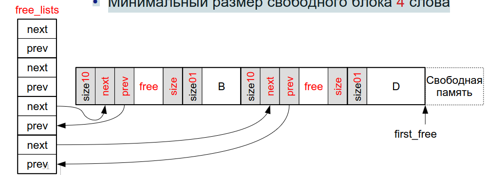

 Этот механизм пригоден для всевозможных
организаций «куч», но сравнительно узких
классов размеров
● Для каждого размера из поддерживаемого
диапазона должен быть отведен свой список
свободных блоков
● Основные преимущества — скорость и
отсутствие заголовков
● Если не требуется слияния блоков
● Увеличение размера на месте возможно:
● Для последнего отведённого пулом блока
● При поддержке слияния блоков - если за
расширяемым блоком следует свободный блок

Преимущества 

* скорость
* отсутствие заголовков

image::media/2024-03-13-10-04-20.png[]

=== Раздельное хранение блоков разного размера 
В качестве основы используем связный пул из
мультиблоков
● «Куча» кусочная, мультиблоки отводятся
первичной системой отведения памяти
● #Мультиблок# -- массив блоков заданного
размера
● Кратность мультиблока -- длина массива
● Кратность может быть постоянной или функцией
размера блоков
● Определим обрабатываемый класс размеров
как отрезок арифметической прогрессии (от минимального к максимального с заданным шагом, 
● Заданы минимальный и максимальный размеры и
шаг)
● Все параметры кратны округлению

Слияние и деление блоков не имеют смысла
● Блоки разного размера расположены в разных
мультиблоках
● Увеличение размера на месте возможно
только в пределах шага (т.е. в пределах округления)


Если размер передается компилятором, для
каждого размера блоков из класса создадим
свой связный пул

* Сначала пытаемся отвести блок из этого пула
* Если он пуст, отводим новый мультиблок, делим его на блоки, добавляем их в пул
* При освобождении блока добавляем его в соответствующий его размеру пул

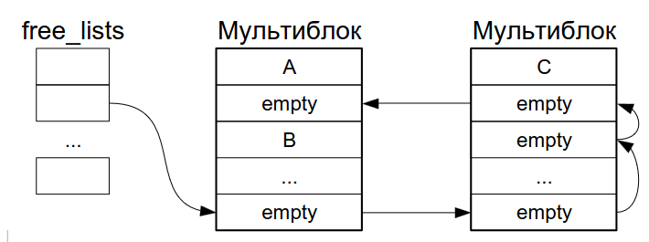

Это очень простая и быстрая, но негибкая
реализация, потому  что

* Мультиблоки никогда не возвращаются в первичную систему
* Мультиблоки никогда не перераспределяются между размерами
* Низкая локальность -- список, который прошивает блоки, разбросанные по памяти.

Если размер не передается компилятором (например, язык С), по адресу блока нужно получить его размер

● Пусть размер всех мультиблоков
фиксированная степень 2 (1 << N)
● Кратность мультиблока зависит от размера
входящих в него блоков
● Пусть мультиблоки
выровнены на их
размер
● Снабдим мультиблок
служебным
заголовком (хранит размер блока и проч. Из-за этого заголовка образуются потери из-за округления (серенькие))
● Будем в нем хранить
размер блока

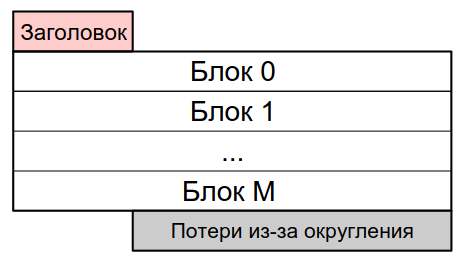

огда адрес заголовка вычисляется
обнулением N младших битов адреса
входящего в мультиблок блока
● И вообще любого адреса внутри этого блока

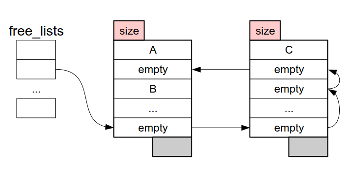


Для освобождения и перераспределения мультиблоков добавим в заголовок
● Ссылку (или две для двусвязного циклического
списка) на следующий мультиблок с этим
размером блоков
● Список свободных блоков мультиблока
● Счетчик занятых блоков

Отведение происходит
в первом
мультиблоке из
списка
● Полностью
заполненный
мультиблок
перемещается в
конец списка
● Освободившийся
мультиблок
возвращается в пул
свободных
мультиблоков

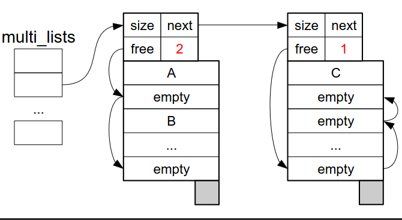


● Основные преимущества — скорость и
отсутствие заголовков у блоков
● У мультиблока есть заголовок, но он используется
всеми блоками этого мультиблока
● Недостатки
● Узкий класс размеров
● Потери на выравнивание в хвосте мультиблока
● Потери на выравнивание мультиблоков в памяти
● Для любого размера, в т.ч. непопулярного, должен
быть отведен минимум один мультиблок
● Непопулярные мультиблоки могут быть слабо
заполнены
● Фрагментация за счет распределения блоков
между многими мультиблоками
● Низкая локальность
● Особенно в варианте с глобальными списками
свободных блоков