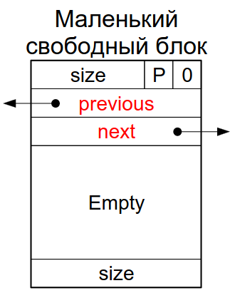
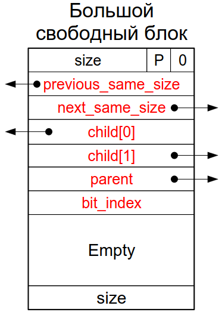

= Оценка эффективности отведения памяти в «куче» 

== История
* Пусть у нас есть какая-то система управления
«кучей»
* Мы хотим узнать её свойства и сравнить с
другими системами на некотором наборе
нагрузок
* Затраты времени, затраты памяти, длительность
выполнения операций...
* Раньше (во времена Кнута) пытались строить вероятностные модели нагрузки, распределения отводимых блоков по размеру и
времени жизни и доказывать теоремы о свойствах системы отведения памяти на данной модели

Оказалось, что вероятностные модели плохо
применимы к отведению и освобождению
объектов, так как:

*  Поведение приложений в основном
детерминировано
*  Блоки известных размеров отводятся и
освобождаются в определенной
последовательности, которая в целом зафиксированна
* В приложениях есть циклы и условные предложения, что вызывает лизкие к периодическим паттерны отведений и
освобождений
* В приложениях есть фазы, меняющие поведение

В результате вычисленные по вероятностным моделям параметры не соответствуют практически наблюдаемым. 

Более сложные вероятностные модели (например,
марковские) точнее описывают приложения, но про
них трудно доказывать теоремы. Поэтому на практике поступают иначе.

== Трассы отведения памяти
Инструментируем интерфейсные функции системы
отведения памяти так, чтобы они записывали в
файл последовательность своих вызовов, включая
имя функции, параметры и полученный результат

Например, в текстовом формате

```
<timestamp> <function_name>(<params>) : <result>
```

Параметры и результат - целые числа и указатели

Подойдет любой формат, лишь бы его было
удобно читать человеку и разбирать компьютеру

Такие файлы называются #трассами отведения памяти#. Запустим приложение, сохраним полученную трассу. Повторим этот процесс несколько раз для
нескольких важных нам приложений.

=== Компилятор трасс

Отфильтровывает только интересные для нас
данные из заданной трассы и проверяет их корректность, ошибки могут быть следующие: 

* Трасса может содержать посторонние события и
лишние поля
* Каждый отведенный объект должен быть
освобожден
* Каждый освобождаемый или изменяющий размер
объект должен быть отведен (или быть NULL)
* Размеры должны совпадать...


Редкие незначительные ошибки могут быть после
анализа исправлены вручную. Объекты, отведенные до открытия трассы, можно создать в ее начале, а освобожденные после закрытия трассы, можно уничтожить в ее конце.

* Уникально нумерует создаваемые объекты
* Порождает бинарный файл, удобный для быстрого
проигрывания конкретным компьютером

=== Проигрыватель трасс
* Проверяет корректность заголовка заданной
скомпилированной для него трассы
* Готовится к проигрыванию трассы
* Читает число отведенных объектов из заголовка
* Отводит для них массив записей (адрес, размер)


* Нужно избегать вызовов тестируемой системы
управления памятью. Проиграли трассу о


* Читает записи из трассы
* Производит соответствующие вызовы системы
управления памятью
* Изменяет записи в массиве
* Измеряет потраченное время и отведенную
процессу память (можно посмотреть во втором дз -- там есть способ прочесть отведенную процессу память. Это зависит от ОС)

* локальность оценить нельзя, но можно посмтореть счетчики кеш промахов
* фрагментация -- можно посмотреть косвенно по соотношению выделенной памяти и той, которая нужна была процессу

== Практический пример: dlmalloc (Doug Lea's malloc)
Одна из лучших реализаций malloc (по скорости, фрагментации, локальности доступа, настраиваемости (немного параметров), легкости портирования (нейтральный C), поддержке многопоточности) по результатам многих независимых тестов

David Detlefs, Al Dosser, Benjamin Zorn. Memory Allocation Costs in Large C and C++ Programs. Technical Report CU-CS-665-93. Department of Computer Science, University of Colorado. August 1993

Бесплатная, с открытым хорошо
документированным исходным кодом
http://gee.cs.oswego.edu/pub/misc/malloc.html

* Выбор применяемых стратегий, алгоритмов и структур данных осознан и ясно артикулирован 
* Встроенные опционально включаемые возможности для отладки и мониторинга
* Расширенный программный интерфейс для создания множественных «куч» изменяемого размера и массивов однородных объектов

=== Классификация 
Используется непрерывная куча переменного размера. Могут быть созданы несколько «куч». Каждая «куча» может независимо не только увеличиваться, но и уменьшаться

Wilderness preservation:

* Свободный блок в конце кучи обрабатывается как бесконечно большого размера
* Поэтому он делится последним из-за поиска наилучшего подходящего блока

Поиск наилучшего подходящего блока (Best Fit) для минимизации фрагментации. Поэтому бесконечный блок в конце кучи используется в последнюю очередь.

Среди блоков одного размера выбирается ранее всех освобожденный (FIFO) для увеличения шансов слияния с освободившимися соседними блоками. Чем дольше блок в памяти -- тем больше вероятность, что вокруг него что-то освободится и блок сольется с соседом.

==== Мгновенное слияние
Минимизация фрагментации может происходить в ущерб скорости
обработки популярных размеров. Поэтому для повышения скорости можно кэшировать отдачу и отведение объектов некоторых типов и размеров в
одном или нескольких пулах, реализованных поверх
данной кучи. Эти пулы должны учитывать особенности
конкретной программы

==== Преимущественное деление
Если блок точного размера не найден, сначала пытаемся делить последний (по времени) делившийся блок. За счет этого увеличивается локальность последовательных
отведений.

==== Параметры алгоритма: Классы размеров блоков
Выравнивание блоков — двойное слово (8 байт). Блоки разделяются по размеру на маленькие, большие и огромные

* Минимальный размер большого блока 256 байт
* Минимальный размер огромного блока 1 МБ

Эти размеры управляются константами времени компиляции и могут быть изменены. К блокам разного размера применяются разные механизмы. В свободных блоках разного размера хранятся по-разному устроенные служебные данные. Огромные блоки отводятся (освобождаются) отдельными вызовами mmap (munmap).

===== Маленькие блоки
Минимальный размер
определяется структурой
свободного блока - 4 слова

Блоки разделяются на классы
размеров от минимального
маленького блока (16 байт) с
шагом в округление (8 байт)
до минимального большого,
не включая его (256-8=248)

В пределах каждого класса размеров *свободные* блоки объединяются в двусвязный циклический список. Удаление из него происходит при отведении блока или слиянии его с соседним блоком того же или другого размера (используется метод граничных признаков).



===== Большие блоки 
Блоки разделяются на классы по логарифму размера round_down(log2(размер)) от 8 до 31 включительно
* В пределах класса блоки организованы в двоичное префиксное дерево (бор, trie).
* Блоки одного размера связаны в двусвязный циклический список
* Best Fit
* Если блоков найденного размера несколько, из них
выбирается тот, который раньше всех добавлен в
дерево

